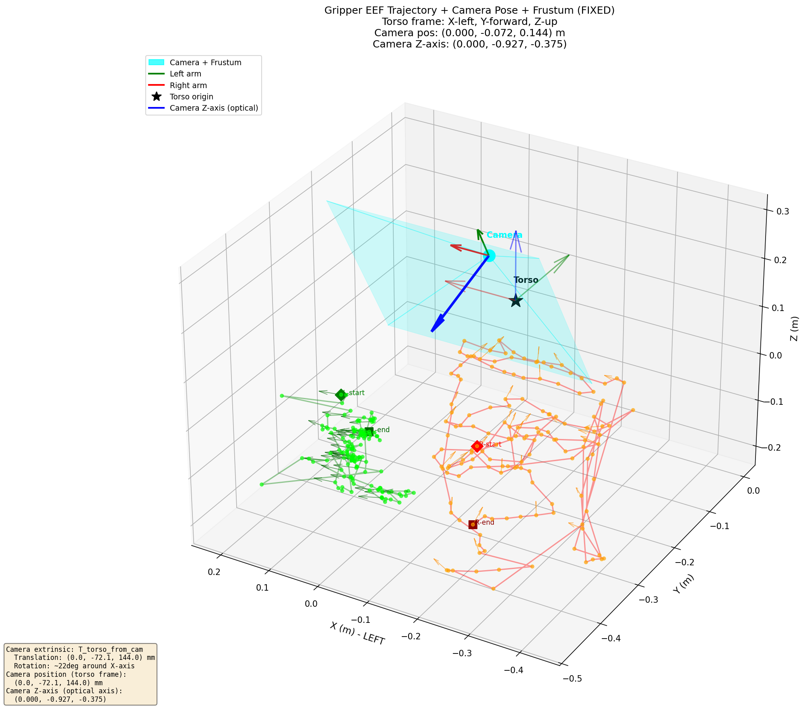

# Gripper Projection — 机械臂夹爪投影可视化工具

> 将机械臂（夹爪）末端执行器（EEF）的 3D 位姿投影到相机图像上，并进行 3D 场景可视化。
> 可用于夹爪在头部视频当中的定位跟踪，实现数据自动化质检或自动化标注等功能

## 项目概述

本项目提供了一套机器人夹爪视觉可视化工具，包含三个核心脚本：

| 脚本 | 功能 |
|------|------|
| `visualize_gripper_projection.py` | 将左右夹爪的 3D 坐标**投影到相机视频帧**上，输出带标注的单帧图像 |
| `visualize_gripper_projection_trail.py` | 在视频上绘制夹爪投影的**运动拖影（trail）**，输出 MP4 视频 |
| `visualize_3d_gripper_fixed.py` | 生成**3D 场景图**：显示相机位姿、视锥（frustum）和夹爪运动轨迹 |

## 数据说明

- 输入数据为 **Parquet** 格式，包含机械臂关节/末端位姿数据
- 相机：鱼眼模型（Fisheye），分辨率 1408×1280，视频缩放至 640×480
- 外参矩阵 `T_torso_from_cam`：相机坐标系 → torso 坐标系（X 向左，Y 向前，Z 向上）

### 关键参数

| 参数 | 值 |
|------|-----|
| 相机内参 | FX=517.16, FY=517.18, CX=703.78, CY=641.31 (1408×1280) |
| 畸变系数 | k1=0.0919, k2=-0.0033, k3=-0.0144, k4=0.0034 |
| 外参平移 | tx=0, ty=-72.14mm, tz=144.02mm（相机在 torso 坐标系中的位置） |
| 外参旋转 | 绕 X 轴旋转约 112°（俯视操作台） |

## 环境要求

```bash
pip install numpy pandas opencv-python matplotlib pyarrow
```

> 注意：脚本中 parquet 文件路径为服务器路径，使用时需根据实际情况修改。

## 使用方法

### 1️⃣ 夹爪投影可视化（单帧图像）

将左右夹爪 3D 坐标投影到相机视频帧上，标记投影点位置。

```bash
python visualize_gripper_projection.py /path/to/task_dir
```

- `task_dir`：任务目录，需包含 `data/chunk-xxx/episode_xxxxxx.parquet` 和 `videos/chunk-xxx/episode_xxxxxx.mp4`
- `--output / -o`：输出目录（默认 `task_dir/projection_vis/`）
- `--every / -n`：采样间隔帧数（默认 5）

**输出**：每帧带标注的图像（frame_xxxxx.jpg），绿色=左臂，橙色=右臂，红色=超出画面。

### 2️⃣ 夹爪投影拖影可视化（视频）

在视频上绘制夹爪运动拖影（当前帧、10帧前、20帧前），输出为 MP4。

```bash
python visualize_gripper_projection_trail.py --video /path/to/video.mp4
```

- `--video`：输入视频路径
- `--parquet`：对应 parquet 路径（不传则自动推断）
- `--output`：输出 MP4 路径

**拖影颜色**：
- 左臂：鲜绿（当前）→ 蓝绿 → 暗蓝绿（随时间衰减）
- 右臂：橙色（当前）→ 暗橙 → 暗红（随时间衰减）

### 3️⃣ 3D 场景可视化

生成包含相机位姿、视锥和夹爪轨迹的 3D 空间图。

```bash
python visualize_3d_gripper_fixed.py
```

> ⚠️ 该脚本中的 parquet 路径为绝对路径，需修改 `parquet_file` 变量。

**输出**：`gripper_3d_visualization_fixed.png`

## 输出示例

### 3D 场景图


*相机位姿（青色）、视锥（半透明）、左右夹爪运动轨迹（绿/红），以及 torso 坐标系原点*

### 拖影视频

#### Episode 000000
<video src="episode_000000_trail.mp4" controls width="640"></video>

*夹爪投影拖影效果：连续显示当前/过去帧的投影位置，形成运动轨迹*

#### Episode 000001
<video src="episode_000001_trail.mp4" controls width="640"></video>

*另一个 episode 的夹爪投影拖影效果*

## 投影流程

```
torso坐标系3D点 (m) 
    ↓ P_cam = R.T @ (P_torso - t)          （外参逆变换）
相机坐标系3D点
    ↓ 鱼眼投影：x=X/Z, y=Y/Z, theta=atan(r)  （畸变模型）
归一化平面
    ↓ u = fx * xd + cx, v = fy * yd + cy    （内参矩阵）
图像像素坐标 (u, v)
    ↓ u' = W - u, v' = H - v                （双轴翻转）
最终图像坐标
```

## 坐标系说明

- **torso 坐标系**：机器人躯干坐标系，X 向左、Y 向后、Z 向上
- **相机坐标系**：光轴（Z）指向操作台，Y 向下，X 向右
- 外参 `T_torso_from_cam` 表示：相机坐标 → torso 坐标的变换

## 许可证

本项目仅供学习和研究使用。
